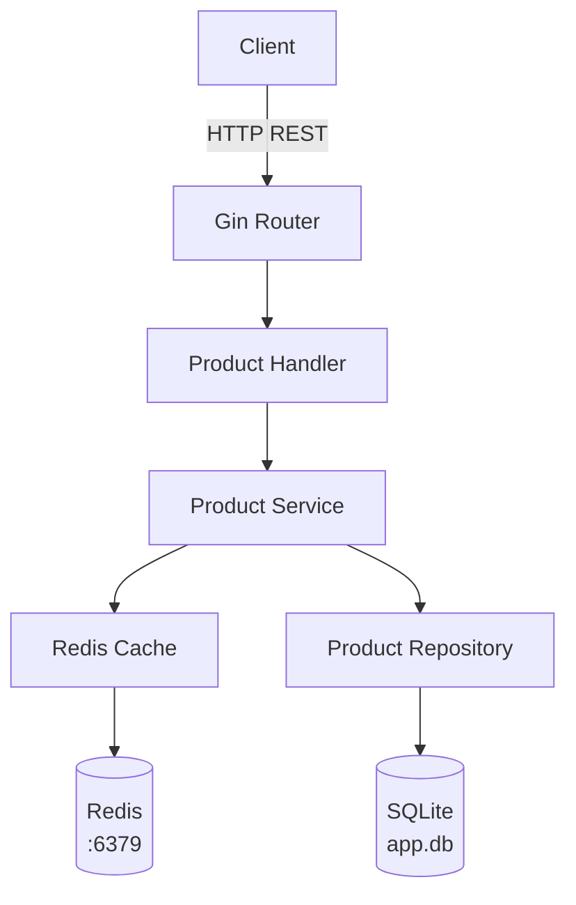
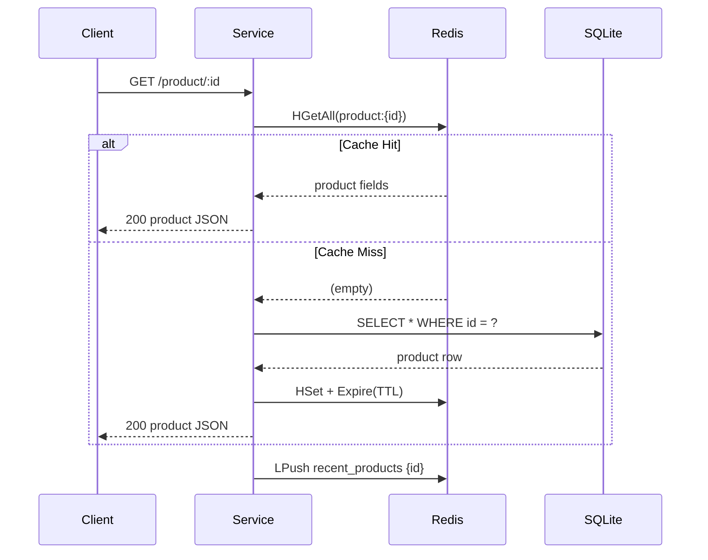
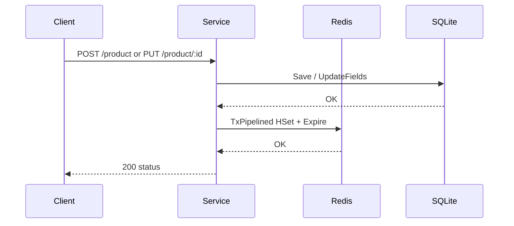

# goCachedAPI

A RESTful Product API built with Go that implements a **cache-aside pattern** using Redis as a caching layer and SQLite as the persistent store. Frequently accessed products are served directly from Redis, with automatic TTL expiry and a rolling list of recently viewed products.

---

## Tech Stack

| Layer       | Technology                     |
|-------------|--------------------------------|
| HTTP Router | [Gin](https://github.com/gin-gonic/gin) v1.12 |
| ORM         | [GORM](https://gorm.io) v1.31 + SQLite |
| Cache       | [Redis](https://redis.io) 7 (via go-redis v9) |
| Config      | [godotenv](https://github.com/joho/godotenv) |
| Container   | Docker Compose                 |

---

## Architecture



### Cache-Aside Read Flow



### Write / Update Flow



---

## Project Structure

```
goCachedAPI/
├── cmd/api/
│   └── main.go               # Entry point – wires all dependencies
├── internal/
│   ├── config/config.go      # Loads env vars with defaults
│   ├── db/db.go              # Opens SQLite, runs AutoMigrate, seeds data
│   ├── models/product.go     # Product GORM model
│   ├── repository/           # Raw DB operations (GORM)
│   ├── cache/                # Redis get/set/delete + recent list
│   ├── service/              # Business logic – coordinates repo & cache
│   ├── handlers/             # HTTP handlers (Gin)
│   └── routes/routes.go      # Route registration
├── docker-compose.yml        # Redis container
├── go.mod / go.sum
└── .env                      # (optional) local overrides
```

---

## Configuration

All config is driven by environment variables (or a `.env` file in the project root).

| Variable              | Default            | Description                              |
|-----------------------|--------------------|------------------------------------------|
| `APP_PORT`            | `:8080`            | Port the HTTP server listens on          |
| `REDIS_ADDR`          | `localhost:6379`   | Redis address                            |
| `SQLITE_DSN`          | `app.db`           | SQLite database file path                |
| `PRODUCT_TTL_SECONDS` | `60`               | How long a product lives in cache (secs) |
| `RECENT_LIST_KEY`     | `recent_products`  | Redis key for the recent products list   |
| `RECENT_LIMIT`        | `10`               | Max entries kept in the recent list      |

Example `.env`:
```env
APP_PORT=:8080
REDIS_ADDR=localhost:6379
SQLITE_DSN=app.db
PRODUCT_TTL_SECONDS=120
RECENT_LIMIT=5
```

---

## Spin Up

### Prerequisites

- [Go 1.21+](https://go.dev/dl/)
- [Docker + Docker Compose](https://docs.docker.com/get-docker/)

### 1. Clone & install dependencies

```bash
git clone <repo-url>
cd goCachedAPI
go mod download
```

### 2. Start Redis

```bash
docker compose up -d
```

> **Note:** If you have a local Redis already running on port 6379, stop it first:
> ```bash
> sudo systemctl stop redis-server
> sudo systemctl disable redis-server   # prevent it from restarting on boot
> ```

### 3. Run the API

```bash
go run ./cmd/api
```

The server starts on `http://localhost:8080`. On first run, GORM auto-migrates the schema and seeds one product.

---

## API Endpoints

| Method | Path                      | Description                                  |
|--------|---------------------------|----------------------------------------------|
| POST   | `/product`                | Create or update a product                   |
| GET    | `/product/:id`            | Fetch a product (cache-aside)                |
| PUT    | `/product/:id`            | Update name & price (Redis transaction)      |
| DELETE | `/product/:id`            | Delete from DB and evict from cache          |
| POST   | `/product/:id/invalidate` | Evict a product from cache only              |
| GET    | `/recent_products`        | List recently viewed products (from Redis)   |

---

## Test cURLs

### Create / Upsert a product
```bash
curl -s -X POST http://localhost:8080/product \
  -H "Content-Type: application/json" \
  -d '{"id": 1, "name": "Widget", "price": 999}' | jq
```
```json
{ "status": "created/updated" }
```

### Get a product by ID
```bash
curl -s http://localhost:8080/product/1 | jq
```
```json
{ "id": 1, "name": "Widget", "price": 999 }
```

### Update a product (atomic Redis transaction + DB write)
```bash
curl -s -X PUT http://localhost:8080/product/1 \
  -H "Content-Type: application/json" \
  -d '{"name": "Super Widget", "price": 1299}' | jq
```
```json
{ "status": "updated" }
```

### Invalidate a product's cache entry
```bash
curl -s -X POST http://localhost:8080/product/1/invalidate | jq
```
```json
{ "status": "invalidated" }
```
> The next `GET /product/1` will be a cache miss and re-populate Redis from SQLite.

### Delete a product
```bash
curl -s -X DELETE http://localhost:8080/product/1 | jq
```
```json
{ "status": "deleted" }
```

### Get recently viewed products
```bash
curl -s http://localhost:8080/recent_products | jq
```
```json
[
  { "id": 2, "name": "Gadget", "price": 499 },
  { "id": 1, "name": "Widget", "price": 999 }
]
```

---

## Changelog

See [CHANGELOG.md](./CHANGELOG.md).

